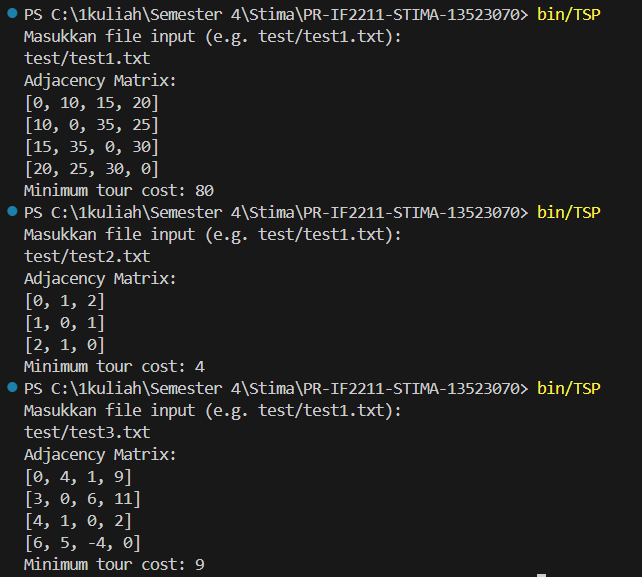

# PR-IF2211-STIMA-13523070

## IF2211 Strategi Algoritma
A simple implementation of the Travelling Salesman Problem (TSP) with Dynamic Programming in Rust

## How to Compile
```
rustc TSP.rs -o ..\bin\TSP.exe
```
The program will be compiled in the 'bin' folder

## How to Run
```
./TSP or bin/TSP
```

The program will ask the user to input a .txt file that contains the TSP problem in the form of adjacency matrix.

The txt file itself follows this format:
```
n
w11 w12 ... w1n
w21 w22 ... w2n
.
.
.
wn1 wn2 ... wnn

n = Number of nodes
w = distance of each node
```

Further examples can be seen within the 'test' folder

## Result Examples


## Author
Sebatian Hung Yansen - 13523070